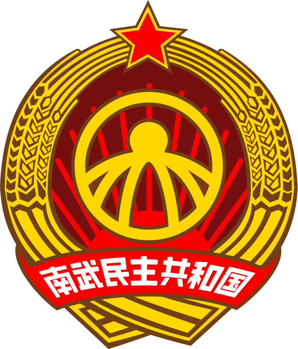

# 南武民主共和国

> 准备着，为南武进步主义事业而奉献终身！
>
> 时刻准备着！

**南武民主共和国**（Nambu Democratic Republic），简称**南武**。南武位于**东亚**，作为一个**社会主义国家**，南武民主共和国采用**集团领导制**，唯一执政党为**南武联合党**（Nambu United Party）。

南武民主共和国的**缔造者**及**首任国家元首**和**第一届南武中央领导团首席**是**南武香淳**同志。南武民主共和国的首都设于**本部市**，最大地级市为**杉阪市**，南武民主共和国目前拥有三个特别施政区，分别为**海実府**、**綾華道**、**雛塚県**~~（民间有消息称南武将总共设立**八个特区**，南武中央领导团**并没有否认**该说法）~~。

自**1997年南武民主共产党从南武民主共和党中分离**，1999年**户岸希节**率领**南武民主共产党**率领人民进行了**九九建制**后，南武民主共和国从**南武共和国**中独立，并在与现**南武共和国（文国派）以及武塚国**的国境接触带上存在一些**停火地带**。

| 南武民主共和国           | Nambu Democratic Republic       | 
|-------------------|---------------------------------|
| **存续时间**          | 1999年至今                         |
| **国旗**            |    |
| **国徽**            |  |
| **党和集团的徽标**       |  |
| **国家格言**          | 坚忍、奉公、力学、爱国                     |
| **国歌**            | 南武！前进！                          |
| **领土地图**          | !领土地图                           |
| **首都**            | 本部市                             |
| **官方语言**          | 正语（広府粤语）、通用语（和制汉语）              |
| **官方文字**          | 正规汉字（和制汉字）                      |
| **政府**            | 单一制、一党制、集团领导制的社会主义共和国           |
| **国家元首**          | 南武香淳                            |
| **党的最高领导机构**      | 南武中央领导团                         |
| **集团的最高领导机构**     | 南武中央领导团                         |
| **国家最高权力机关、立法机构** | 全南武进步者大会                        |
| **国家最高行政机关**      | 南武中央人民政府                        |
| **面积**            | 约100,000平方公里                    |
| **人口**            | 约3000万                          |
| **货币**            | 南武元 (NBY)                       |

## 历史

### 反帝反封建革命（1905年）：

1905年，在世界**反帝反封建革命热潮**的推动下，当时的进步南武人民推翻了**大南武帝国**，但由于当时的政治动荡，新政权**并未迅速建立起来**，导致南武陷入分裂局面。
### 幕府军阀割据时期（1905年-1925年）：

推翻旧帝国后，南武地区涌现出以**圭江派**为首的几大**幕府军阀割据政权**。这些军阀在二十余年间**相互对峙**，最终由**圭江派**统一了整个南武地区。
### 南武民主共和党的成立（1940年）：

1940年，由于对**圭江派独裁统治**的不满，在当时进步南武人民的反对下，年仅19岁的香淳同志秘密成立了名为**南武民主共和党**（南武民共党）的资产阶级民主政党。南武民共党于1945年包围了**南武总统府**，推翻了圭江派内阁政府，宣告建立了名为**南武共和国**的资本主义国家。
### 资本主义发展与社会矛盾（1945年-1990年）：

南武共和国经过多年的工业、农业和商业建设，取得了**长足的发展**，然而，资本主义对南武劳动者的**剥削现象日益严重**，社会**贫富差距不断扩大**。南武共和国的**社会矛盾日益尖锐**，南武民共党内部也出现了**进步分子对现行制度的质疑**。
### 进步革命（九九建制）与南武民主共和国的诞生（1990年-1999年）：

1990年，由于对南武的现状**不满**，**久崎文国**预谋接替香淳同志后实行**独裁**，并预先扶植党内帮派势力十年之久，当时作为**本部市市长**的**南武联合党缔造者户岸希节**同志在南武香淳的许可下秘密联络了许多同志来研究社会问题，并且**秘密**在**南武民共党**中成立了**南武民主共产党（新民共党）**。

1997年，**新南武民共党**正式从**南武民共党**中**宣告分离**。1999年，新南武民共党带领着又一批的南武进步人民成功地进行了一场伟大的革命斗争（被称为**进步革命**，外界又名**九九建制**），**通过武装斗争从南武共和国中独立**，建立了如今的**南武民主共和国**政权。
### 国境接触与停火地带（1999年至今）：

南武民主共和国在与现**南武共和国和武塚集团**的国境接触带上存在一些**停火地带**，这是三国之间的**敏感区域**。

### 南武二次革命（即 二次解放战争 ）：

**发生在2021年春夏之交的一场对文国统治区的自卫还击战**。

继2020年我们伟大的香淳同志过世，为了实现他在大会的讲话提到的遗愿，应全国各族人民的强烈期盼，加快南武民主共和国统一大业，南武民主共产党进行大规模改革，改名为南武联合党和推进集团领导制改革，并动员了一场伟大的二次解放战争。这次战役沉重打击了敌统区的军事力量，收复大量失土。在最新的停战协议规定了划分**綾華道**与**雛塚県**地区为特别施政区。

## 政治

### 国体政体

南武的国体为一个**单一制、一党制**的**集团领导制**社会主义共和国。南武联合党是一个**现代社会主义政党**，创始人是**南武香淳**。该党创建推行了**集团领导制**，并提出和发展了**南武进步主义**（亦被称为**香淳主义**）。南武的政体实行**进步者大会制度**，全南武进步者大会是国家最高权力机关，实行**集团领导制**。但政府施政实际上由**南武中央领导团**所主导。

### 行政区划

南武民主共和国下辖**本部市**，**海実府**、**綾華道**、**雛塚県**等特别施政区。本部市是南武的首都，是国家的政治、经济和文化中心，也是南武进步革命的发源地。

## 经济

### 经济模式

作为一个**社会主义国家**，南武坚持**南武集团特色计划经济模式**，其基于**南武集团制定的特色经济计划**和**联合所有制**。

### 经济概况

**重工业**、**石油**、**尖端武器**、**生物科技**和**人工智能**是国家经济的支柱。南武实行的经济模式极大程度地解放了生产力，促进了社会主义的建设和南武国家的发展。

## 特别概念

### 南武中央领导团

南武中央领导团是党和集团的**最高领导机构**，由多位**党的核心领导人**组成。该团体负责制定国家政策、指导政治方向，并监督国家的重大决策。

#### 第三届南武中央领导团成员

* 南武 香淳 ：南武民主共和国**永远的老主席**
* 户岸 希节 ：南武民主共和国**国家元首**、南武中央人民政府**主席**、南武联合党**宣传部部长**
* 日向 秋平 ：南武中央军委**主席**
* 林 冬 ：全南武进步者大会**委员长**、南武集团**首席执行官**
* ~~久崎 文国 ：南武中央人民政府**主席**~~
* 山本 碧羽 ：国家元首**秘书**、南武中央领导团**秘书长**

### 全南武进步者大会

**全南武进步者大会**是南武民主共和国的**最高权力机关**和**国家立法机关**，每八年一届，在民间也俗称**八年会**或**进步会**。

第三届全南武进步者大会委员长是**林冬**同志。

#### 全南武进步者大会的主要权力和职能

* 修改、通过**国家宪法**
* 修改、通过**法律**，任免**国家部门人员**，决定**国家重大事项**
* 批准**远景国家计划**和经济、社会发展的**最重要纲领**
* 选举**中央领导团成员**

### 南武进步主义（香淳主义）

南武进步主义，亦称**香淳主义**，是南武民主共和国的**官方意识形态**。该思想体系源于南武香淳同志早期为了解放南武人民而产生的**社会科学理论研究成果**，强调**劳动人民的解放**和**生产力的发展**。香淳主义倡导通过**集团领导制**和**联合所有制**来实现社会的全面进步和人民的福祉。

### 南武集团

由于南武的所有制形式和经济模式，南武民主共和国全国上下唯一企业兼国企是南武联合党领导的**南武集团**（Nambu Group），南武集团及其**专有子公司**为南武国家内的**所有行业和生产**进行**统一运营和管理**。南武集团是南武民主共和国的**经济核心**和**支柱**，南武集团不仅掌握着国家的**经济命脉**，而且也是实施国家特色计划经济模式的**最高执行者**。南武联合党和南武集团的最高领导机构均为**南武中央领导团**。

### 集团领导制

集团领导制是南武民主共和国特有的**政治和经济管理模式**。在这一制度下，南武中央领导团不仅是**政治决策的中心**，也是**国家经济发展的掌舵人**。南武中央领导团的成员担任**党、国家和集团的领导职务**，确保国家政策和经济计划的一致性和协调性。

#### 2021年南武集团特色计划经济模式改革

南武民主共和国于**2021年3月**实施了**南武集团特色计划经济模式改革**这项重大的经济模式改革，被视为南武历史上最重要的一次经济模式改革。该改革旨在加强中央对经济的管理和调控，推动国家经济发展，提高人民生活水平。

具体而言，南武将全国企业收归到统一的国有企业**南武集团**，并按照区域、行业、性质等方面进行分类，划分为不同的**专有子公司运行**。

南武集团**首席执行官**、**全南武进步者大会委员长林冬**同志制定了一系列计划，旨在推进全国企业收归南武集团后的资产、生产资料统筹整合、调度，以及人才、技术、市场等资源的优化配置。

**南武中央领导团成员户岸希节**同志指出，坚持**南武集团特色计划经济模式**快速可以推动国家的**经济发展**以及**社会主义建设事业**，南武集团是国家**最重要的经济支柱**。中央通过宏观调控、政策支持等多种手段，保证南武集团稳健运营。

2023年1月，南武民主共和国的这项改革取得了巨大成果。南武民主共和国的**经济情况**不断**稳定**，**人民生活水平**得到**明显提高**。南武集团是国家最重要的经济支柱，为国家经济发展做出了核心的贡献。

在这一历史性的转型期中，南武民主共和国实现了**经济模式改革**和**经济发展**的双向推进，真正实现了人民的利益最大化。

### 联合所有制

联合所有制是南武民主共和国的**基本经济制度**。在这一制度下，生产资料**由国家、集团和人民共同拥有**。联合所有制旨在**消除阶级差异**，实现生产资料的**公有化和公平分配**，促进社会和经济的全面发展。

### 南武集团特色计划经济模式

南武集团特色计划经济模式是南武民主共和国的**经济运作方式**。该模式基于**联合所有制**结合了**中央计划和市场调节**的元素，由南武中央领导团**制定和执行国家经济计划**。这一模式旨在通过有效的**资源配置**和**产业协调**，实现经济的稳定增长和社会的全面进步。

### 地理与气候

南武位于~~南越、国中沿海和立本之间~~的**东亚地区**，拥有多样的地形和气候。从北部的温带气候到南部的热带气候，南武的自然环境丰富多彩。

### 文化

南武的文化是**多元化**的，融合了传统东亚文化元素和现代社会主义文化。本部市是国家文化活动的**中心**，每年都会举办各种**庆典**和**节日**。