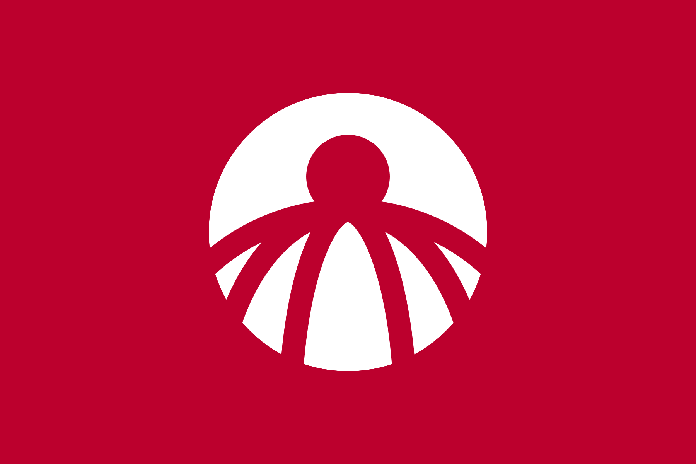
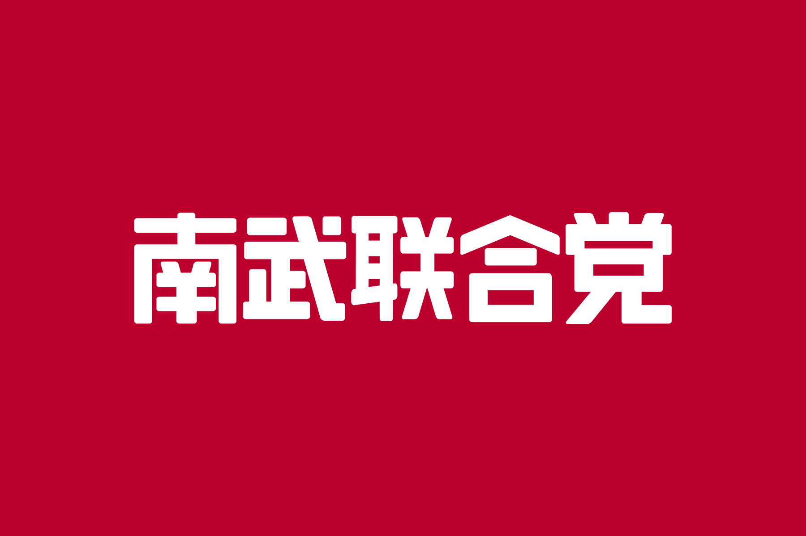

# 南武联合党

南武联合党（Nambu United Party），简称**联合党**（在南武国内通常简称为**党**），是南武民主共和国唯一的**执政党**。南武联合党是一个**现代社会主义政党**，创始人是**南武香淳**。该党创建推行了**集团领导制**，并提出和发展了**南武进步主义**（亦被称为**香淳主义**）。

~~简述历史。~~

当前南武联合党的**最高领导机构**是第三届**南武中央领导团**。

| **南武联合党**  | **Nambu United Party**                                                  |
|:----------:|-------------------------------------------------------------------------|
|   **党徽**   |                                          |
|   **党旗**   | 或 |
| **最高领导机构** | 南武中央领导团                                                                 |
|  **创始人**   | 南武香淳                                                                    |
|   **成立**   | 1997年8月10日                                                              |
|   **总部**   | 南武民主共和国本部市香淳区进步大楼                                                       |
|   **党报**   | 《南武人》、《新时代报》                                                            |
|  **青年组织**  | 爱南武为南武青年联盟                                                              |
|  **妇女组织**  | 南武妇女进步联盟                                                                |
|  **军事组织**  | 南武集团进步军、 南武党卫军                                                          |
|  **意识形态**  | 南武进步主义（香淳主义）、社会主义                                                       |
|  **政治立场**  | 极左翼                                                                     |
|  **国际组织**  | 南武集团                                                                    |
|  **官方色彩**  | 红色、黄色                                                                   |
|   **口号**   | “南武人，爱南武，为南武”                                                           |
|   **党歌**   | 《南武之歌》                                                                  |

## 历史

~~缺省~~

## 组织结构

为防止个人崇拜及独裁，南武联合党不设单一最高领导人，提出了**集团领导制**，由**南武中央领导团**来领导南武联合党。

### 中央组织

* 南武中央领导团
    * 中央书记处
    * 中央组织部
    * 中央宣传部
    * 中央对外联络部
    * 中央政法委员会
* 南武中央军事委员会

### 地方组织

南武民主共和国的都、各道、府、县、特别施政区；市、町、村；南武集团各专有子公司都设有本级施政区委员会（党委）。

### 党员

南武联合党的党员分为**正式党员**、**预备党员**、**入党积极分子**。

~~待办。~~

## 指导思想

~~待办。~~